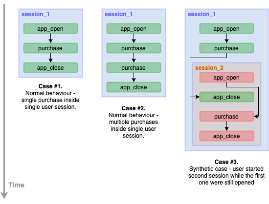

[](https://coveralls.io/github/vvlasov-python-to-bigdata/capstone-project?branch=main)

# Python to BigData: Capstone Project

* [Overview](#overview)
* [Solution Description](#solution-description)
  * [Project structure](#project-structure)
  * [How user session for the task#1 is calculating](#how-user-session-for-the-task1-is-calculating)
* [Usage](#usage)
  * [Prerequisites](#prerequisites)
  * [Set up for development](#set-up-for-development)
  * [Running the tests](#running-the-tests)
  * [Build](#build)
  * [Run on local Spark](#run-on-local-spark)
  * [Run on remote Spark cluster](#run-on-remote-spark-cluster)
* [Documentation](#documentation)

## Overview

This is a final project of _Python Engineer to BigData Engineer_ LP 
including marketing analytics BigData tasks on sample dataset. The solution is made using `PySpark v3.1.1`.

#### List of tasks:
* **Task #1.1.** Build purchases attribution projection (using default SparkSQL) [**[Source code]**](/src/jobs/task1/purchases_attribution_sql.py)
* **Task #1.2.** Build purchases attribution projection (using custom UDF)
* **Task #2.1.** Calculate top marketing campaigns by revenue [**[Source code]**](/src/jobs/task2/top_marketing_campaigns_sql.py)
* **Task #2.2.** Calculate the most popular marketing channel [**[Source code]**](/src/jobs/task2/most_popular_channels_sql.py)

#### Additional tasks:
* **Task #2.1(2).** Calculate top marketing campaigns by revenue (using Spark DataFrame API only) [**[Source code]**](/src/jobs/task2/top_marketing_campaigns_df_api.py)
* **Task #2.2(2).** Calculate the most popular marketing channel (using Spark DataFrame API only) [**[Source code]**](/src/jobs/task2/most_popular_channels_df_api.py)

## Solution Description

This section describes project structure, general approach for the solution and tasks implementation details.

See more details about the project structure in [Project structure section](#project-structure).

Each task is in a separated Python file imitating a Spark job. All tasks source code is placed in `src/jobs` folder. 
Another module in `src` folder - `src/shared`, contains utilitary code to use in all jobs:
* `src/shared/spark.py` - has function `start_spark_session()` which determines running environment - on local Spark 
or on remote Spark cluster and creates related Spark session object, logger wrapper object and parses configuration
into dictionary if presented. In case of local run, job uses default test configuration or you can specify your own (see [Run on local Spark](#run-on-local-spark)). For remote run, each files ends with `_config.yaml` will be recognized as config file and parsed.
* `src/shared/logging.py` - has class `Log4jWrapper` which is a wrapper over Spark Log4j logger. This class allows simply write logs to Spark job logs with prefix `<SPARK_APP_ID SPARK_APP_NAME>`.

All Python files for each task have the similar structure. Main idea of the structure is that, in terms of ETL job, 
the 'Transormation' step should be isolated from the 'Extract' and 'Load' steps. Each job step is incapsulated in 
its own function and communicates using `DataFrame` objects, e.g. the 'Transformation' step takes input data as 
one or more DataFrame objects and returns the transformed data as a single DataFrame object. All steps are used in 
`main()` method which initializes SparkSession object and uses it to work with data. This approach allows easily 
test each step of the job and makes 'Tranformation' step _idempotent_.

Each job may have a set of job-specific parameters, like input data folder, output folder, some hyperparameters. 
Jobs parametrization is supported via YAML files. In my opinion, it is a more flexible way rather than using Python script 
arguments because allows adding new parameter without source code changing and have a well-structured view of all parameters of a job. There is a strict contract for config files naming - they should have `_config.yaml` suffix. It is needed for running job on a remote Spark cluster - function `src/shared/spark.py#start_spark_session()` automatically finds all files with this suffix in Spark root directory and parses its as configuration. So, for local runs you can use test configuration which each job uses by default and send specific prodaction config files to Spark cluster when run a job on remote cluster.

### Project structure

The repository has the following structure:
```
./
 |-- _dist/                             # folder for build artifacts
 |-- docs/                              # additional docs and pictures
 |-- config/                            # jobs config as YAML files
      |-- test/
      |-- prod/
 |-- src/
      |-- jobs/                         # jobs definition
      |-- shared/                       # Python code available for each job
 |-- tests/
      |-- _data/                        # test data
           |-- dummy                    # fake small data to check jobs tranformations
           |-- mobile_app_clickstream   
           |-- purchases_attribution    # data calculated in task #1
           |-- user_purchases
      |-- jobs/                         # tests for jobs
      |-- shared/                       # tests for shared modules
 |   .env                               # file witn environment variables for pipenv
 |   .gitignore
 |   .noserc                            # nosetests settings
 |   .pylintrc                          # pylint settings
 |   LICENSE
 |   Makefile
 |   Pipfile
 |   Pipfile.lock
 |   README.md
```

The main module containing Spark jobs definition is `src/jobs`. Module `src/shared` contains Python code which 
is packing together with jobs definition and can be used in all jobs. This module contains a wrapper for 
Spark Log4j logger to use it in Python code and a function which initialize Spark session object depends on 
environment.

Any configuration parameters, like paths to input data and ouput folder, can be specified in YAML files in `config/` folder. Note, that these files should have `_config.yaml` suffix.

File `Makefile` contains the project setting up and building commands definition.

Folder `_dist` is using by the `Makefile` to store temporary build artifacts and final archive - `jobs.zip`.

Files `Pipfile` and `Pipfile.lock` configure Python environment and its dependencies. For this environment the are a 
set of environment variables saved in `.env`.

Files `.noserc` and `.pylintrc` stores configuration for _nosetests_ and _pylint_ to simplify its usage.

### How user session for the task#1 is calculating

In `task #1` it is necessary to add field `sessionId` to the resulting projection:
```
// a session starts with app_open event and finishes with app_close 
sessionId: String
```

Theoretically, we can have the following cases of user session (omitting useless event types):



Cases **#1** and **#2** - we can mark all `app_open` events, leading with `app_close` event (using windowing by `userId`), with a unique id and then add this id for all events happened between related `app_open` and `app_close` events (**This approach was used for the solution**).

Case **#3** - need to take into account overlapping sessions. We can add additional grouping by `campaign_id` and `channel_id` when calculating leading events for `app_open` event and use the first `app_open` event and the last `app_closed` event. We can group sessions came from one channel and campaign into one.

The first approach was chosen for the task because, analysis of the whole input data shows that there is no overlapping sessions at all. Moreover, there is only one session with only one purchase per user.

## Usage

This section describes how to build, run and work with the project.

There is a `Makefile` to setup development environment, build and run tests. You can run 
```
make help
```
to see all available commands with the `Makefile`.

### Prerequisites

> **NOTE**
>
> Is is recommended to use `MacOS` or `Linux` to build or run this porject.
>
> But if you are using `Windows` make sure you have `make` command
> installed from `GNUWin32` package: http://gnuwin32.sourceforge.net/packages/make.htm.

Please make sure you have installed the following:

* `Python 3.7+`
* `PySpark v3.1.1+`
* [`pipenv`](https://pypi.org/project/pipenv/)
  <details>
    <summary>How to install</summary>
  
    <code>python -m pip install pipenv</code>
  </details>

### Setup

Execute the following command to set up the project:
```
make venv
```

This command makes the following:
* Checks that `pipenv` installed
* Creates Python virtual environment in `.venv` folder
* Install all project dependencies to the virtual environment

### Running the tests

Run the following command to execute all tests:
```
make test
```

### Build

There is an ability to pack all jobs files and its dependencies into one ZIP archive called `jobs.zip` to use it on remote Spark cluster.

To do this run the command:
```
make build
```

This command makes the following:
* Clean up `_dist` folder
* Download all Python dependencies to `_dist` folder
* Copy all files from `src/jobs` and `src/shared` to `_dist` folder
* Create archive called `jobs.zip`

### Run on local Spark

To run a certain Spark job on local cluster, use the following commands:
```
make venv
pipenv run python <PATH_TO_JOB_FILE>
```
where 
* `<PATH_TO_JOB_FILE>` - relative path to Python file describing a Spark job, e.g. 'src/jobs/task1/purchases_attribution_sql.py'

By default in local run mode all jobs uses test configuration specific for the job (you can browse [./config/test](./config/test) to find it). Test configuration uses test data which is 5 random files from each input dataset.

To use other configuration (e.g. [production configuration](./config/prod) which uses whole datasets), add the path to the configuration file while running a job:
```
make venv
pipenv run python <PATH_TO_JOB_FILE> <PATH_TO_CONFIG_FILE>
```

For example:
```
pipenv run python src/jobs/task1/purchases_attribution_sql.py config/prod/purchases_attribution_config.yaml
```

### Run on remote Spark cluster

After [building](#build) the archive with jobs and its dependencies you can run a job with `spark-submit` command:
```
$SPARK_HOME/bin/spark-submit \
    --master <YOUR_MASTER_NODE> \
    --py-files packages.zip \
    --files <PATH_TO_CONFIG_FILE> \
    <PATH_TO_JOB_FILE>
```
where:
* `<YOUR_MASTER_NODE>` - a Spark cluster master node address. See [Spark Master URLs](https://spark.apache.org/docs/latest/submitting-applications.html#master-urls)
* `<PATH_TO_CONFIG_FILE>` - relative path to the job's configuration file in YAML format. The file should be ended with `_config.yaml`, e.g. 'config/prod/purchases_attribution_config.yaml'
* `<PATH_TO_JOB_FILE>` - relative path to Python file describing a Spark job, e.g. 'src/jobs/task1/purchases_attribution_sql.py'

For example, command to run `purchases_attribution_sql.py` job:
```
make build
$SPARK_HOME/bin/spark-submit \
    --master yarn> \
    --py-files packages.zip \
    --files config/prod/purchases_attribution_config.yaml \
    src/jobs/task1/purchases_attribution_sql.py
```

> **NOTE**
>
> When running a job on remote Spark cluster, you **should** use 
> a configuration file with at least paths to input data and 
> output directory.

## Documentation

This section contains list of additional documentation.